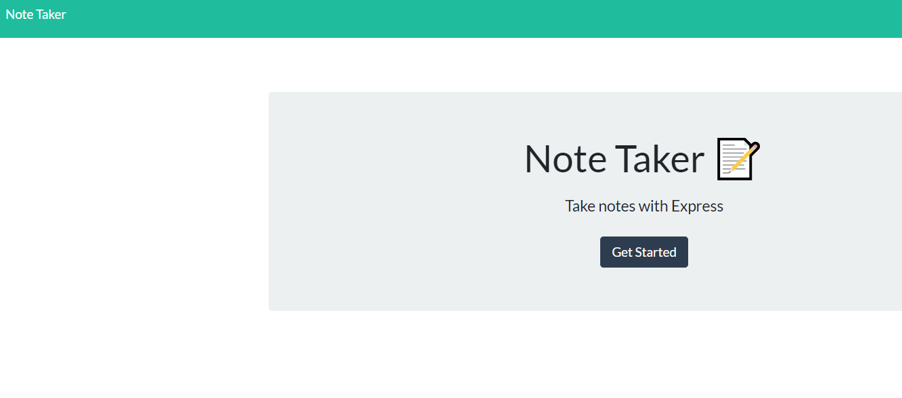
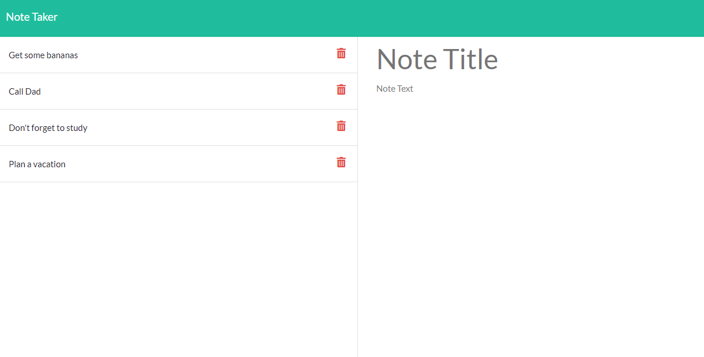

# Express.js: Note Taker

 

## Description

This is a note taking application used to write and save notes using Express.js. It saves and retrieves note data from a JSON file.

## Table of Contents 
* [Description](#description)
* [Usage](#usage)
* [Screenshots](#screenshots)
* [License](#license)
* [Questions](#questions)

## Usage 

Create a note by entering a title and text and then click save. To view saved notes, click on them in the left side. Delete a note by clicking the trash icon.

## Screenshots

## License

MIT
https://opensource.org/licenses/MIT

## Questions

* If you have any questions or concerns, please contact me at https://github.com/ricapi96, or email me at enroquemore@gmail.com.

